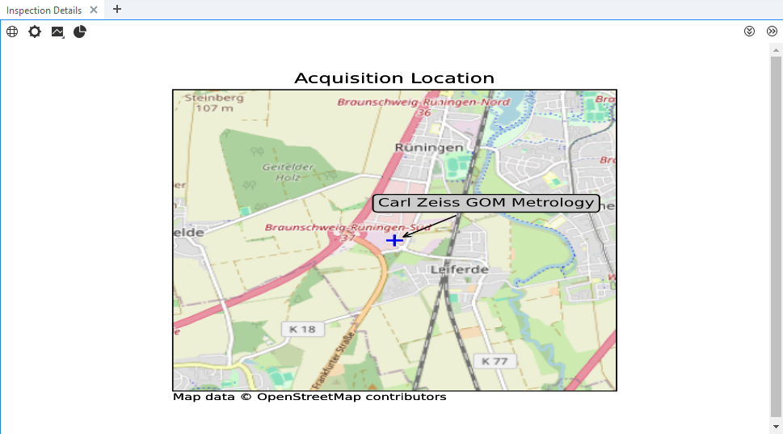

# OSMMapCustomDiagram



## Short description

`LocationScalarElement.py` provides a custom `ValueElement` contribution for entering latitude, longitude, altitude, and an optional label. Its `finish()` method publishes serializable element data to the `OSMMapCustomDiagram` `SVGDiagram` contribution. The diagram uses Cartopy, Matplotlib, NumPy, and OpenStreetMap tiles.

Location information is entered manually in the custom element dialog.

> [!CAUTION]
> OpenStreetMap tiles are downloaded at runtime, so the ZEISS INSPECT process needs network access.

## Prerequisite

Review [Using custom diagrams](https://zeiss.github.io/zeiss-inspect-app-api/2027/howtos/using_custom_diagrams/using_custom_diagrams.html) and [Custom actuals and nominals](https://zeiss.github.io/zeiss-inspect-app-api/2027/howtos/custom_elements/custom_nominals_actuals.html).

## Diagram data routing

The custom element returns data using the modern API contract:

```python
{
    'value': 42.0, # dummy data
    'data': {
        'latitude': 51.0,
        'longitude': 13.0,
        'altitude': None,
        'label': 'Location'
    }
}
```

`finish()` calls `add_diagram_data()` with the diagram contribution ID instead of the legacy `ude_diagram_*` fields.

## Diagram settings

Map title, range, aspect ratio, marker style, marker size, marker color, and label offsets are available under Preferences > App-Settings. They are defined in `metainfo.json` and read through the Settings API.

## View the map diagram

The map is shown in the Inspection Details tab in the 3D view. Adding or editing contributing location elements updates the diagram.

## References

- [Cartopy documentation](https://cartopy.readthedocs.io/en/stable/)
- [OpenStreetMap](https://www.openstreetmap.org/)
- [OpenStreetMap tile usage policy](https://operations.osmfoundation.org/policies/tiles/)
