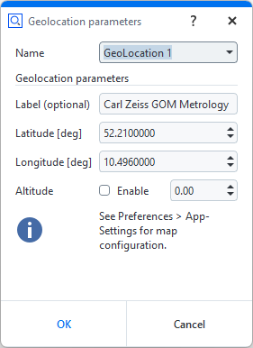
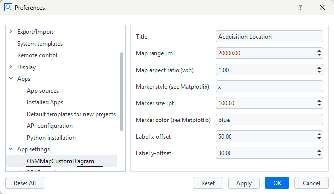

# OSMMapCustomDiagram


## Short description

`LocationScalarElement.py` provides a custom `ValueElement` contribution for entering latitude, longitude, altitude, and an optional label. Its `finish()` method publishes serializable element data to the `OSMMapCustomDiagram` `SVGDiagram` contribution. The diagram uses Cartopy, Matplotlib, NumPy, and OpenStreetMap tiles.

Location information is entered manually in the custom element dialog.

> [!CAUTION]
> OpenStreetMap tiles are downloaded at runtime and cached locally by Cartopy, so the ZEISS INSPECT process needs network access when a tile is not already cached.

## Prerequisite

Review [Using custom diagrams](https://zeiss.github.io/zeiss-inspect-app-api/2027/howtos/using_custom_diagrams/using_custom_diagrams.html) and [Custom actuals and nominals](https://zeiss.github.io/zeiss-inspect-app-api/2027/howtos/custom_elements/custom_nominals_actuals.html).

> [!WARNING]
> This App requires Python 3.13.x because the current version of Cartopy does not provide a binary wheel for Python 3.14.x. See [Adding and using specific Python versions](https://zeiss.github.io/zeiss-inspect-app-api/2027/howtos/python_versions/python_versions.html) for setup instructions.

## Start the services

Open **Apps > Manage Services** and start both App services:

- **OSMMapLocation** provides the GeoLocation custom actual element.
- **OSMMapCustomDiagram** renders the OpenStreetMap diagram.

## Create a GeoLocation custom element



Create an **OSM Map Location** custom actual element and configure its geolocation parameters:

| Parameter | Description |
| --- | --- |
| Name | Project element name. New elements are numbered automatically as `GeoLocation 1`, `GeoLocation 2`, and so on. |
| Label (optional) | Text displayed next to the location marker on the map. |
| Latitude [deg] | Latitude in decimal degrees from -90 to 90. |
| Longitude [deg] | Longitude in decimal degrees from -180 to 180. |
| Altitude | Optional altitude value. Select **Enable** to include it in the map annotation. |

Select **OK** to create the element. The element contributes its location data to the map shown in **Inspection Details**. Create additional GeoLocation elements to display multiple locations on the same map.

## Diagram data routing

The custom element returns data using the modern API contract:

```python
{
    'value': 5000.0,
    'data': {
        'latitude': 51.0,
        'longitude': 13.0,
        'altitude': None,
        'label': 'Location',
        'map_range': 5000.0
    }
}
```

The scalar value and `map_range` track the current map range. This makes a zoom-triggered element recalculation produce changed project data, which causes Inspection Details to request a fresh diagram render.

`finish()` calls `add_diagram_data()` with the diagram contribution ID.

## Diagram settings



The map settings are available under **Preferences > App settings > OSMMapCustomDiagram**. They are defined in `metainfo.json` and accessed through the [Settings API](https://zeiss.github.io/zeiss-inspect-app-api/2027/python_api/python_api.html#gom-api-settings).

| Setting | Description |
| --- | --- |
| Title | Heading displayed above the map. |
| Map range [m] | Geographic range around the center of all locations. The interactive `+` and `-` controls also update this value. |
| Map aspect ratio (w:h) | Minimum width-to-height ratio used for the geographic extent. The diagram also accounts for the available panel dimensions. |
| Marker style (see Matplotlib) | Matplotlib marker symbol used for each location, for example `x` or `o`. |
| Marker size [pt] | Size of the location markers. |
| Marker color (see Matplotlib) | Matplotlib color specification used for the location markers, for example `blue` or `#0050b3`. |
| Label x-offset | Horizontal offset of labels from their location markers, in points. |
| Label y-offset | Vertical offset of labels from their location markers, in points. |

## View the map diagram

The map is shown in the Inspection Details tab in the 3D view. Adding or editing contributing location elements updates the diagram.

## Interactive zoom

The map provides `+` and `-` controls in its upper-right corner. They are SVG diagram overlay points, so the controls remain fixed to the map frame rather than moving with the geographic coordinates.

Clicking `+` halves the `range` setting; clicking `-` doubles it. The range is clamped to 100 m through 1,000,000 m. Each click updates the App setting and forces element recalculation because App settings are not tracked by the project dependency graph. The changed location result causes the diagram to render again with the corresponding geographic extent and Cartopy tile zoom. Previously downloaded tiles can be reused from Cartopy's local cache.

The controls use the `SVGDiagram` event callback mechanism and do not provide map panning. The diagram forwards each zoom request to `osm_map_zoom_callback.py`, which is registered as `userscript.osm_map_zoom_callback`. This regular userscript applies the new range and triggers element and project recalculation. It calls `gom.read_parameters(globals())` before reading the `finish_event()` payload, as required by ZEISS INSPECT 2025 and later.

When installing or updating this example from an external folder, refresh the App in the App Editor after adding the callback files.

## References

- [Cartopy documentation](https://cartopy.readthedocs.io/stable/)
- [Cartopy OpenStreetMap tiles API](https://cartopy.readthedocs.io/stable/reference/generated/cartopy.io.img_tiles.OSM.html)
- [OpenStreetMap](https://www.openstreetmap.org/)
- [OpenStreetMap tile usage policy](https://operations.osmfoundation.org/policies/tiles/)
