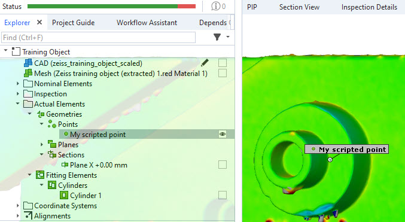
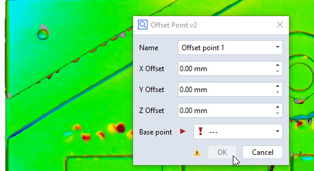

# CustomPoint



## Short description

> [!NOTE]
> This is a basic example meant to introduce you to the concept of custom nominal and actual elements. Therefore, head over to the [How-to: Custom elements](https://zeiss.github.io/zeiss-inspect-app-api/main/howtos/custom_elements/custom_nominals_actuals.html) for the documentation of this example.

This App demonstrates three custom point element contributions registered via `@apicontribution`,
arranged in order of increasing complexity:

| Class | Type | Features |
|---|---|---|
| `ActualPoint` | `actuals.Point` | Bare minimum: returns base center coordinate |
| `ActualOffsetPoint` | `actuals.Point` | Offset, validation, custom data tokens, logging |
| `NominalOffsetPoint` | `nominals.Point` | Offset, validation, custom data tokens, logging, widget filter, event handler |

`ActualOffsetPoint` and `NominalOffsetPoint` share a common `generate_point_element()` helper function.



## Highlights

### Bare minimum: `ActualPoint`

`ActualPoint` shows the absolute minimum required for a custom actual element contribution:

- `__init__`: Registers the contribution with a unique `id` and a human-readable `description`.
- `dialog`: Delegates to `self.show_dialog()` — one call to display the dialog and return user input.
- `compute_stage`: Reads `values['base'].center_coordinate` and returns it directly as the point value.

No offset, no validation, no logging.

### Adding offset and data tokens: `ActualOffsetPoint`

`ActualOffsetPoint` extends the pattern with:

- **Offset computation**: adds `offset_x/y/z` to the base element's center coordinate.
- **Validation**: raises a `ValueError` if any offset component is less than 1, which is shown
  as a computation error in the ZEISS INSPECT element properties.
- **Custom element data tokens**: the `"data"` key in the `compute_stage()` return value stores the
  offset values as element tokens (`offset_x`, `offset_y`, `offset_z`), accessible like any
  other element property:
  ```python
  element = gom.app.project.actual_elements['Custom Actual Point 1']
  print(element.offset_x)  # e.g. 10.0
  ```
  > [!NOTE]
  > Custom element data tokens work for both **actual** and **nominal** elements.
- **Logging**: inputs and result are logged via `self.add_log_message(context, 'info', ...)`.

### Advanced dialog and event handler: `NominalOffsetPoint`

`NominalOffsetPoint` adds three further features on top of the offset logic:

- **(+) Widget filter**: the dialog is created explicitly with `gom.api.dialog.create()` so that
  a filter can be applied to the `base` selector before display:
  ```python
  self.dlg.base.filter = lambda e: hasattr(e, 'center_coordinate')
  ```
  Only elements that expose a `center_coordinate` are selectable. The OK button is managed
  automatically based on the filter result.
- **(+) Dialog event handler**: the `event` method is called on dialog lifecycle events:
  - On `dialog::initialized`: sets a status hint prompting the user to select a valid base element.
  - On `dialog::changed`: clears the hint when a valid base is selected.
- **(+) Preview recomputation**: returning `True` from `event` on `dialog::changed` requests a
  preview recomputation.
  > [!NOTE]
  > The exact conditions under which the preview is shown in the 3D view depend on the ZEISS INSPECT version and element type.

### Logging

`ActualOffsetPoint` and `NominalOffsetPoint` use `self.add_log_message(context, 'info', ...)` to
write diagnostic messages. These appear in the element's computation log within ZEISS INSPECT.

## Related

* [Extensions API - gom.api.extensions.actuals.Point](https://zeiss.github.io/zeiss-inspect-app-api/main/python_api/python_api.html#gom-api-extensions-actuals-point)
* [Extensions API - gom.api.extensions.nominals.Point](https://zeiss.github.io/zeiss-inspect-app-api/main/python_api/python_api.html#gom-api-extensions-nominals-point)
* [How-to: Custom elements](https://zeiss.github.io/zeiss-inspect-app-api/main/howtos/custom_elements/custom_nominals_actuals.html)
* [How-to: User-defined dialogs](https://zeiss.github.io/zeiss-inspect-app-api/main/howtos/user_defined_dialogs/user_defined_dialogs.html)