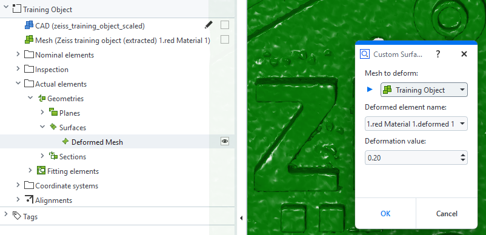

# CustomSurfaceDeformMesh

## Short description

> [!NOTE]
> This example is a companion to the [How-to: Custom elements](https://zeiss.github.io/zeiss-inspect-app-api/2027/howtos/custom_elements/custom_nominals_actuals.html).

This App creates a custom actual surface from a selected mesh or CAD body. It uses NumPy to read the element data and the third-party `trimesh` library to apply random noise deformation to the vertices.

## Highlights

The dialog lets the user select a mesh or CAD body and set the deformation magnitude. The element name is based on the source element using the pattern `<source name>.deformed <number>`, with automatic numbering for repeated deformations. The selected element is filtered by type before it is passed to the custom surface contribution.

The service reads the selected element's coordinates and triangle connectivity, creates a `trimesh.Trimesh`, applies `trimesh.permutate.noise`, and returns the resulting vertices and triangles to ZEISS INSPECT.

This is the modern custom-element counterpart to the deprecated [`TrimeshDeformMesh`](../../../scripted_actuals/TrimeshDeformMesh/doc/Documentation.md) scripted-actual example.

## Related links

- [How-to: Custom elements](https://zeiss.github.io/zeiss-inspect-app-api/2027/howtos/custom_elements/custom_nominals_actuals.html)
- [API: `actuals.Surface`](https://zeiss.github.io/zeiss-inspect-app-api/2027/python_api/python_api.html#gom-api-extensions-actuals-surface)
- [trimesh noise](https://trimesh.org/trimesh.permutate.html#trimesh.permutate.noise)
