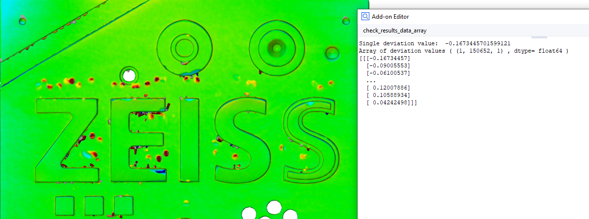

# CheckResultsDataArray



## Short description

This example demonstrates two ways of accessing result data from checks using the element properties and data interfaces.

## Highlights

Basically, if you have obtained an `gom.Reference` element reference, e.g. by selecting an element by name (`gom.app.project.inspection['Surface comparison 1']`), you can access the results of the check.

### 1. Accessing element results by evaluating an expression

```python
single_scalar_value = element.get ('result_dimension[0].deviation')
```
  
* simple for single values
* works without using `numpy` library

### 2. Accessing element results by the data interface using the `.data` token

```python
scalars = np.array (element.data.result_dimension.deviation)
```

* gets large datasets of all stages very efficiently

## Related

* How-to: [Access element properties and data](https://zeissiqs.github.io/zeiss-inspect-addon-api/2025/howtos/python_api_introduction/python_api_introduction.html#access-element-properties)
