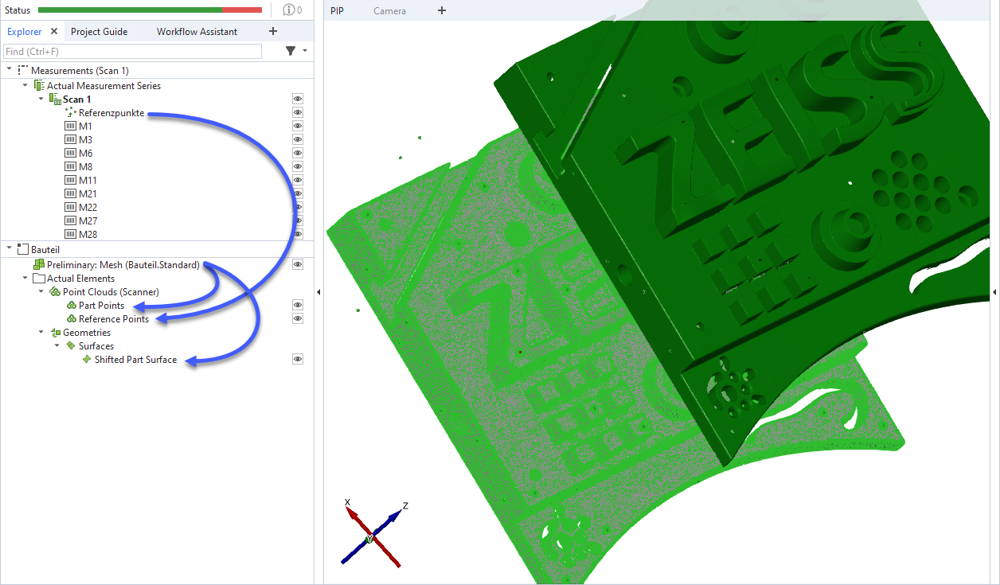
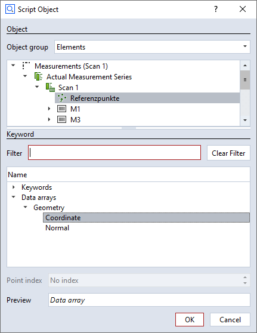
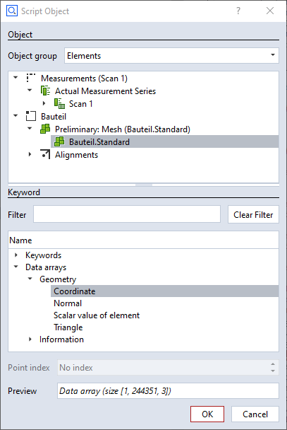
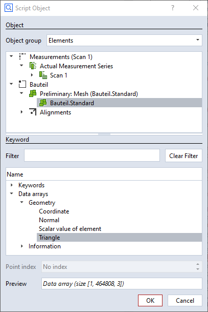
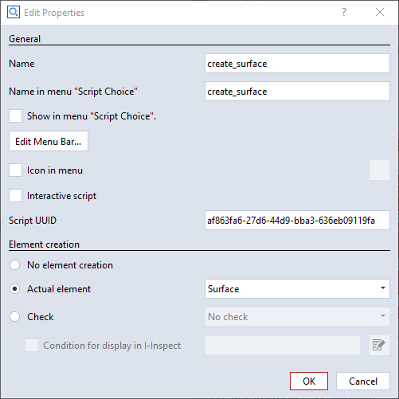

# ReferencePointsAndMeshData

{w=800px}

## Short description

This example demonstrates how to access the reference points in a measurement and the mesh from Python. For demonstration purposes, scripted point clouds or scripted surfaces are created from both data structures, respectively.  

## Highlights

### 1. Accessing the reference points of a measurement

In the Script Object dialog, select the keyword `Data arrays/Geometry/Coordinate` of the reference points element:



The resulting Python data structure is a numpy-array of shape (1, \<n\>, 3):

Index 0
: Stage

Index 1
: Reference Points [0...\<n\>-1]

Index 2
: Coordinate [x, y, z]

```python
reference_points = np.array (gom.app.project.measurement_series[MEASUREMENT_SERIES].results['points'].data.coordinate)
```

`reference_points[0]` (i.e. stage index 0) gives a 2-dimensional numpy-array of the reference points' coordinates:

```
[[-235.58721273  -39.50188087  -21.06407058]
 [-191.48581469  -13.62221568  -48.50181859]
 ...
 [ 228.23743314   41.62522002 -141.81405049]]
```

`reference_points[0].tolist()` creates an ordinary Python list from the numpy-array:

```
[[-235.5872127320349, -39.501880871176816, -21.064070577410664],
 [-191.48581468551652, -13.62221567687171, -48.50181859232822], 
 ..., 
 [228.23743314034266, 41.62522001509065, -141.8140504931894]]
```

This can be used as input parameter to a script for creating a point cloud element: 

```python
create_point_cloud = gom.script.sys.create_element_by_script (
    check_type='none', 
    element_type='point_cloud', 
    name=element_names['reference_points'], 
    parameters= {
      'points': reference_points[0].tolist()
    }, 
    script_uuid='ff73513a-e857-43da-b4d2-382f80f25c28'
)
```

The function `gom.script.sys.create_element_by_script()` calls the script `create_point_cloud.py` by its `script_uuid`. The `script_uuid` can be found via the Add-on Explorer in the Script Properties (see [3. Script for creating a surface element](#3-script-for-creating-a-surface-element)).

### 2. Accessing a mesh

In the Script Object dialog, select the data structures `Data arrays/Geometry/Coordinate` and `Data arrays/Geometry/Triangle` of the mesh element:



The **coordinates** are the vertex points of the mesh.

The resulting Python data structure is a numpy-array of shape (1, \<n\>, 3):

Index 0
: Stage

Index 1
: Vertex Points [0...\<n\>-1]

Index 2
: Coordinate [x, y, z]

```python
part_points = np.array (gom.app.project.parts[PART].actual.data.coordinate)
```

Example:
```
[[[-260.26819582  -55.07607781  -29.85369619]   
  [-260.2262357   -54.66295906  -29.56445928]   # Index 1
  [-260.22035056  -54.82045257  -30.00434273]
  [-260.20548655  -55.16190509  -29.58630829]
  [-260.19041153  -54.08518361  -29.07912709]   # Index 4
  [-260.18363995  -54.31011231  -29.50854346]   # Index 5
  ...
  [ 223.86296211  175.77943045 -208.493199  ]]]
```

Numpy-arrays can be handled very efficiently. The following code example creates a copy of the original mesh vertex points and shifts all points in Z direction by 200mm:

```python 
shifted_part_points = part_points.copy()
shifted_part_points[0, :, 2] += 200
```



The **triangles** are the edges between the vertex points. The resulting data structure is a numpy-array of shape (1, \<m\>, 3).

Index 0
: Stage

Index 1
: Triangle [0...\<m\>-1]

Index 2
: Indices into array of vertex points [indexA, indexB, indexC], which define the points A, B, C of each triangle.

```python
part_triangles = np.array (gom.app.project.parts[PART].actual.data.triangle)
```

Example:
```
[[[     1      4      5]
  [     3      6      0]
  [     3      7     11]
  ...
  [244350 244335 244338]
  [244350 244341 244349]
  [244350 244349 244343]]]
```

I.e. the first row (indices into array of vertex points) defines a triangle with points IndexA=1, IndexB=4 and IndexC=5 or edges ab=(1, 4), bc=(4, 5) and ca=(5, 1).

Looking up the indexes in the array of vertex points in the example above gives the point coordinates:

A = [-260.2262357   -54.66295906  -29.56445928]

B = [-260.19041153  -54.08518361  -29.07912709]

C = [-260.18363995  -54.31011231  -29.50854346]


The arrays of vertex points and triangles can be used as input parameters to a script for creating a surface element: 

```python
create_surface = gom.script.sys.create_element_by_script (
    check_type='none', 
    element_type='surface', 
    name=element_names['shifted_part_surface'],
    parameters= {
      'vertices': shifted_part_points[0].tolist(),
      'triangles': part_triangles[0].tolist()
    }, 
    script_uuid='af863fa6-27d6-44d9-bba3-636eb09119fa'
)
```

### 3. Script for creating a surface element

The scripts `create_point_cloud.py` and `create_surface.py` are provided in the example Add-on.

Since no user interaction is required, the `dialog()` function shown in [Introduction to scripted elements](https://zeissiqs.github.io/zeiss-inspect-addon-api/2025/howtos/scripted_elements/scripted_elements_introduction.html) as part of the code pattern can be omitted. Consequently, the checkbox Interactive Script in the Script Properties dialog is disabled.



**`create_surface.py`**:

```python
def calculation(context, params):
    valid_results=False

# Calculating all available stages
for stage in context.stages:
    # Access element properties with error handling
    try:
        context.result[stage] = {
            'vertices':  params['vertices'],
            'triangles':  params['triangles']
        }
    except Exception as error:
        context.error[stage] = str(error)
    else:
    valid_results=True
return valid_results
```

## Related

* How-to: [Access element properties and data](https://zeiss.github.io/zeiss-inspect-app-api/2025/howtos/python_api_introduction/python_api_introduction.html#access-element-properties)
* How-to: [Introduction to scripted elements](https://zeiss.github.io/zeiss-inspect-app-api/2025/howtos/scripted_elements/scripted_elements_introduction.html)
* How-to: [Scripted actuals](https://zeiss.github.io/zeiss-inspect-app-api/2025/howtos/scripted_elements/scripted_actuals.html)
* Python API Specification: [Scripted elements API](https://zeiss.github.io/zeiss-inspect-app-api/2025/python_api/scripted_elements_api.html)
