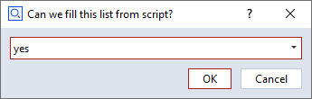

# DropdownWidget



## Short description

This basic example shows how to use the selection list widged (aka. dropdown widget) and how to define items at script runtime.

## Highlights

Suppose you have created a script dialog that contains a `Selection -> Selection element` widget with a widget name `list`.

Then, you can define the items of this dropdown menu by script:

```python
DIALOG.list.items = ['yes', 'we', 'can']
```

## Related

* How-to: [User-defined Dialogs](https://zeissiqs.github.io/zeiss-inspect-addon-api/2025/howtos/python_api_introduction/user_defined_dialogs.html)
