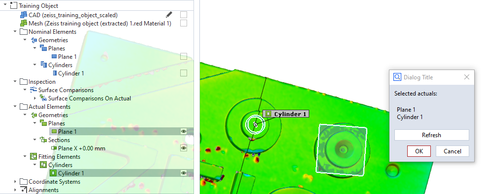

# ExplorerSelectedElementsInDialog



## Short description

Sometimes you might want to get the list of elements currently selected in the element explorer. This example shows how to do so, e.g. in a script dialog.

## Highlights

You can get all elements of a certain category by using a `gom.ElementSelection`. Then you can iterate over this list to check which ones are currently selected.

```python
actual_elements = gom.ElementSelection ({'category': ['key', 'elements', 'part', gom.app.project.parts['Training Object'], 'explorer_category', 'actual']})
selected_actuals = [element.name for element in actual_elements if element.is_selected]
```

```{hint}
As the `gom.ElementSelection`s get pretty lengthy, it is advised to generate these expressions using the "Script Object" explorer (`F2`). Select a category of elements and directly click "OK" to insert a corresponding selection expression.


```

In the example, an exemplary selection of elements is also triggered by the script:

```python
example_selection = [gom.app.project.actual_elements['Plane 1'], gom.app.project.actual_elements['Plane X +0.00 mm']]
gom.script.explorer.apply_selection (selection=example_selection)
```


## Related

* How-to: [Python API Introduction](https://zeissiqs.github.io/zeiss-inspect-addon-api/2025/howtos/python_api_introduction/python_api_introduction.md)
* How-to: [User-defined Dialogs](https://zeissiqs.github.io/zeiss-inspect-addon-api/2025/howtos/python_api_introduction/user_defined_dialogs.md)
* How-to: [Selecting elements in scripts](https://zeissiqs.github.io/zeiss-inspect-addon-api/2025/howtos/python_api_introduction/selecting_elements.md)
