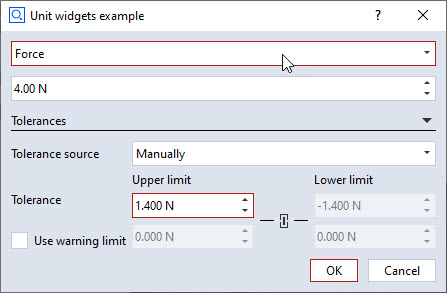

# UnitDialogEventHandler



## Short description

This basic example demonstrates how to use an event handler on a script dialog to set the unit to multiple widgets.

## Highlights

After creating a dialog with `gom.script.sys.create_user_defined_dialog`, you can **set an event handler** to this dialog. In this simple case, the `unit` property of a decimal input widget and a tolerance widget are set according to what the user selected in the `DIALOG.unit` widget:

```python
if widget == DIALOG.unit:
  DIALOG.input.unit = DIALOG.unit.value
  DIALOG.tolerances.unit = DIALOG.unit.value
```
Another interesting part of this example is the corresponding **test**. In `addon_tests/test_dialog_widgets_unit_dialog` is shown how a very basic testing of the event_handler can be implemented:

```python
DIALOG=example.setup_dialog()
# Generating some events to test the event_handler
unit_widget = DIALOG.unit
unit_widget.value = "FORCE"

# Test if the event_handler correctly links widget values
DIALOG.handler(unit_widget)
assert (DIALOG.input.unit == "FORCE")
assert (DIALOG.tolerances.unit == "FORCE")
```

This usage of the `DIALOG.handler` function mimics the user-interaction of changing the value of the `unit` widget manually to `"FORCE"`.

## Related

* How-to: [User-defined Dialogs](https://zeissiqs.github.io/zeiss-inspect-addon-api/2025/howtos/python_api_introduction/user_defined_dialogs.html)
