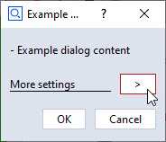
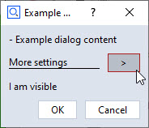

# WidgetVisibility

 

## Short description

This example shows how to use a dialog event handler to turn on/off widget visibilities.

## Highlights

The example dialog was designed to contain a simple text label symbolizing the main content. Below, you find a "More" section consisting of a title, toggle button and a second text label.
The second label's visibility is changed (toggled) by the button.

```python
def dialog_event_handler (widget):
  # [...]
  if widget == DIALOG.button:
    DIALOG.label_bottom.visible = not DIALOG.label_bottom.visible
```


## Related

* How-to: [User-defined Dialogs](https://zeiss.github.io/zeiss-inspect-app-api/2025/howtos/python_api_introduction/user_defined_dialogs.html)
