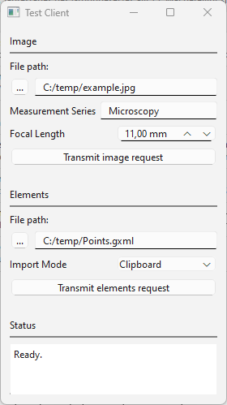

# IPCSockets

Inter Process Communication (IPC) via Internet Sockets

## Socket Server

The ZEISS INSPECT App TestServerApp.py waits for a connection on the interface definded by \<HOST\> and \<PORT\> and expects requests as JSON messages terminated by an EOF (Ctrl-D) character. The server receives a request, sends a response and starts waiting for a new connection.
Press **Esc** in the ZEISS INSPECT main window to stop the server.

### Requests

Two types of requests are supported:

1. **Import image from file**

   **JSON Syntax:** {"image": {"file": \<image_file path\>, "name": \<measurement_series\>, "focal_length": \<focal_length_in_mm\>}}

   **Example:** {"image": {"file": "C:/temp/example.jpg", "name": "other", "focal_length": "50.0"}}

   If the requested measurement series does not exist yet, is created with the command gom.script.sys.create_measurement_series_for_other_images().

    Then, the image is imported with the command gom.script.sys.import_other_images()

2. **Import elements from file**

   **JSON Syntax:** {"elements": {"file": \<elements_file_path\>, "import_mode": \<import_mode\>}}, where \<import_mode\>: "clipboard" or "new_stage"

    **Example:** {"elements": {"file": "C:/Users/IQMPRINK/Documents/Points.gxml", "import_mode": "clipboard"}}
   
    The elements are imported with the command gom.script.sys.import_gom_inspection_exchange(). 

### Responses

The server responds with "O.k." if the request was decoded successfully, otherwise it sends an error message as plain text.

## Socket Client

The client TestClientStandalone.py is implemented as a standalone Python program with a PySide 6 GUI. Export the client script from the App and start it from the Windows command line with `python TestClientStandalone.py`.

After selecting the request parameters, click **Transmit image request** or **Transmit elements request**. This initiates setting up a connection to the server, transmitting the request, receiving the response and finally disconnecting from the server.

The server's response is printed in the text widget labelled 'Status'.

## Testing or debugging the server with Telnet

On Windows 10 and Windows 11, enable Telnet via the Control Panel / Programs and Features / Turn Windows features on.

To use TestServerApp.py with Telnet, change TELNET_MODE=False to **TELNET_MODE=True**. This allows the server to keep the socket connection open until the client disconnects. 

After starting the App TestServerApp.py, start Telnet on the Windows command line with **Telnet localhost 7000**. 

Enter a JSON request in the Telnet window as required. Terminate each JSON request with Ctrl-D. Close the socket connection by typing Ctrl-Z or by terminating Telnet.  

