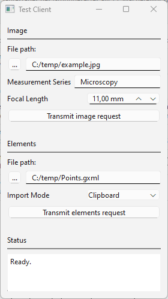

# IPCWebsocketExample

This is an example for triggering command execution in ZEISS INSPECT via the WebSocket protocol. In a broader sense, this example demonstrates how Inter Process Communication (IPC) via the WebSocket protocol can be used to connect ZEISS INSPECT to other applications.

## WebSocket Server
The ZEISS INSPECT App TestServerApp.py waits for connections on the WebSocket interface defined by `ws://<HOST>:<PORT>` and expects requests as strings. The server receives a request, sends a response and starts waiting for a new connection.
Press **Esc** in the ZEISS INSPECT main window or close the client window to stop the server.

### Requests

Three types of requests are supported:

1. **Import image from file**

   **Syntax:** `{"image": {"file": <image_file path>, "name": <measurement_series>, "focal_length": <focal_length_in_mm>}}`


   **Example:** `{"image": {"file": "C:/temp/example.jpg", "name": "other", "focal_length": "50.0"}}`


   If the requested measurement series does not exist yet, is created with the command `gom.script.sys.create_measurement_series_for_other_images()`.

    Then, the image is imported with the command `gom.script.sys.import_other_images()`.

2. **Import elements from file**

   **Syntax:** `{"elements": {"file": <elements_file_path>, "import_mode": <import_mode>}}`, where `<import_mode>`: `"clipboard"` or `"new_stage"`

    **Example:** `{"elements": {"file": "C:/Users/IQMPRINK/Documents/Points.gxml", "import_mode": "clipboard"}}`
   
    The elements are imported with the command `gom.script.sys.import_gom_inspection_exchange()`. 

3. **Syntax:** `quit`
   
   

### Responses

The server responds with `O.k.` if the request was decoded successfully, otherwise it sends an error message as plain text.
In case of the `quit` command, the server responds with `bye` before closing the connection. 

## WebSocket Client



The client `TestClientStandalone.py` is implemented as a standalone Python program with a PySide 6 GUI. Export the client script from the App and start it from the Windows command line with `python TestClientStandalone.py`.

After selecting the request parameters, click **Transmit image request** or **Transmit elements request**. This initiates setting up a connection to the server, transmitting the request, receiving the response and finally disconnecting from the server.

The server's response is printed in the text widget labelled 'Status'.

## Testing or debugging the server

You can test the server by running the following from the command line:

```
python -m websockets ws://<host>:<port>/
```

**Example:**
```
python -m websockets ws://localhost:40010/
Connected to ws://localhost:40010/.
> {"image": {"file": "C:/temp/example.jpg", "name": "Microscopy", "focal_length": "2.0"}}
< O.k.
> {"elements": {"file": "C:/temp/Points.gxml", "import_mode": "clipboard"}}
< O.k.
> quit
< bye
>
Connection closed.
```

# References

* [RFC 6455: The WebSocket Protocol](https://datatracker.ietf.org/doc/html/rfc6455)
* [Python websockets library documentation](https://websockets.readthedocs.io/en/stable/index.html)
