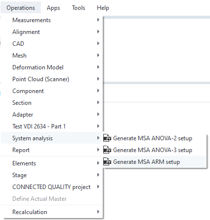

# Measurement System Analysis

## Abstract

This App provides a MSA / Gauge R&R conformal measurement system analysis. It will compute statistical
values based on repetitive measurements to generate values describing the system quality in means of
repeatabillity and reliability.

## Usage

**Start command**

Select command from the "Operations / System analysis" menu:

## Analysis

Read and understand the ANOVA/ARM documentation