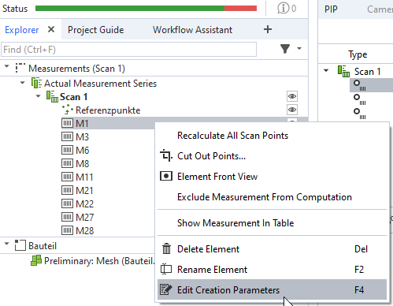
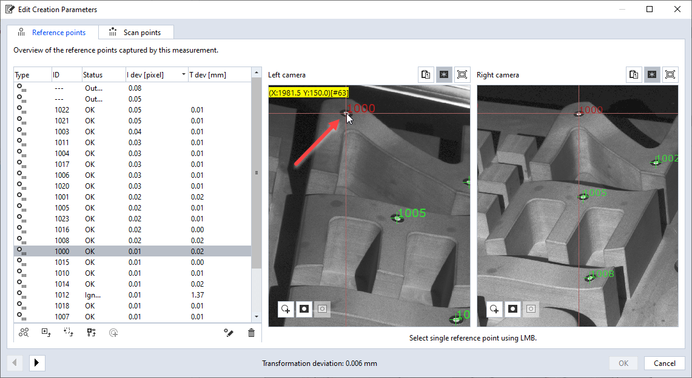

# PointPixelTransformations

## Short description

This example demonstrates how to find the 2D pixel coordinates of a 3D point coordinate and vice versa.

## Highlights

The example uses `gom.api.imaging` functions. The transformations work with any 3D point, but using a reference point increases the comprehensibility.

Each measurement has two arrays for reference points with matching indices:

`measurement.reference_point_id` - The reference points' Ids or `None` for an invalid reference point
`measurement.reference_point_coordinate` - The reference points' coordinates

### 1. Set the point coordinate

```python
measurement = gom.app.project.measurement_series[MEASUREMENT_SERIES].measurements[MEASUREMENT]
stage_index = 0

# Using the first valid reference point in the selected measurement as the point example
for index, id in enumerate(measurement.reference_point_id):
    if id is not None:
        break

reference_point = measurement.reference_point_coordinate[index]
print(f'\tFirst reference point in {MEASUREMENT_SERIES} - {MEASUREMENT}: ID = {id}, P = {reference_point})')
```

Reference points' IDs and coordinates

{w=800px}

### 2. Get the left and right camera image

```python
left = gom.api.project.get_image_acquisition(measurement, 'left camera', [stage_index])[0]
right = gom.api.project.get_image_acquisition(measurement, 'right camera', [stage_index])[0]
```

### 3. Compute 2D pixel coordinates from 3D point

```python
image_coordinates = gom.api.imaging.compute_pixels_from_point ([(reference_point, left), (reference_point, right)])
print(f'\tImage coordinates of reference point (left, right): {image_coordinates}')
```

Output:

```
First reference point in Scan 1 - M1: ID = 1000, P = gom.Vec3d (31.3076865556476, 201.84682632142676, -174.57793227593282))
Image coordinates of reference point (left, right): [gom.Vec2d (1980.7299023612043, 150.31166936961336), gom.Vec2d (2545.676173697585, 124.49594153283601)]
```

### 4. Compute 3D point coordinate from 2D pixels

The resulting 2D pixels from the previous step are used as the input parameters to the transformation.

```python
print(f'\tLeft image: {image_coordinates[0]}, Right image: {image_coordinates[1]}')
use_calibration = False
point_and_residuum = gom.api.imaging.compute_point_from_pixels ([[(image_coordinates[0], left), (image_coordinates[1], right)]], use_calibration)[0]
print(f'\tComputation result: P = {point_and_residuum[0]}, Residuum: {point_and_residuum[1]}')
```

Output:

```
Left image: gom.Vec2d (1980.7299023612043, 150.31166936961336), Right image: gom.Vec2d (2545.676173697585, 124.49594153283601)
Computation result: P = gom.Vec3d (-144.2165521110654, 168.67899387974234, -172.4471527045714), Residuum: 2.906708252303575e-08
```

### 5. For comparison: Interactive display of reference points and pixel coordinates

Explorer: Measurement &mdash; Edit Creation Parameters

{w=400px}


Edit Creation Parameters Dialog

{w=800px}

## Related

* <a href="https://zeiss.github.io/zeiss-inspect-app-api/2025/python_api/python_api.html#gom-api-imaging-compute-pixels-from-point">gom.api.imaging.compute_pixels_from_point</a>
* <a href="https://zeiss.github.io/zeiss-inspect-app-api/2025/python_api/python_api.html#gom-api-imaging-compute-point-from-pixels">gom.api.imaging.compute_point_from_pixels</a>
