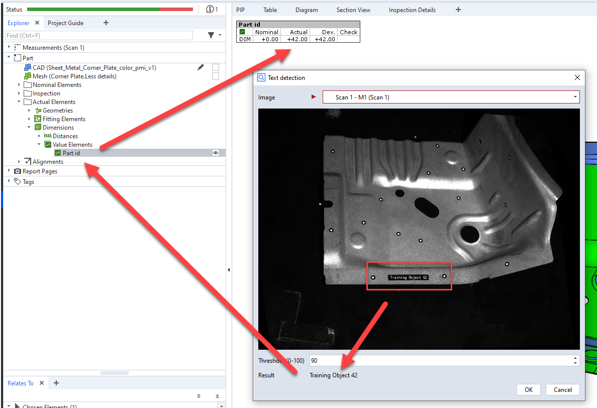

# TextDetection

Text detection in images

This example demonstrates how external libraries can be used to detect and extract text fragments in images. It uses the Tesseract library for that purpose. The resulting element will be a "scripted element" which is neatly integrated into a ZEISS INSPECT project and can be edited, recalculated or checked.

## Preliminaries

The following Python wheels must be installed in the App and are not included due to copyright reasons:

* [numpy](https://pypi.org/project/numpy/)
* [opencv-python](https://pypi.org/project/opencv-python/)
* [pytesseract](https://pypi.org/project/pytesseract/)

In addition, the tesseract executable must be installed and the path to that executable must be adapted in the script.

A detailed documentation can be found in the ZEISS Quality Tech Guide: [How to Create an Advanced App](https://techguide.zeiss.com/en/zeiss-inspect-2025/article/how_to_create_an_advanced_add_on.html).

## Example

