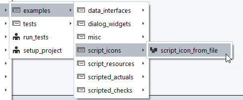
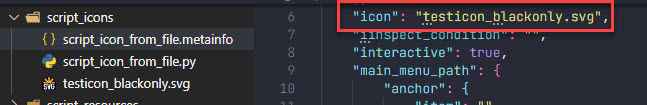
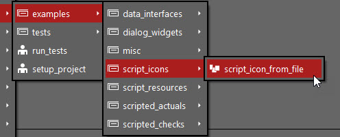

# ScriptIcon

## Short description

This is a small example to show how an icon can be set to a script, whereas the icon itself resides in the App as a resource.

> [!NOTE]
> This example is meant as addition to the information given in how-to: [Adding workspaces to packages - Icon guidelines](https://zeissiqs.github.io/zeiss-inspect-addon-api/main/howtos/adding_workspaces_to_apps/adding_workspaces_to_apps.html#icon-guidelines).

## Highlights

Normally, the icon can be set using the "Script properties" dialog accessible by right-click in the Script Editor of the GOM Software.

However, using VS Code or another text editor, the corresponding `.metainfo` files of the scripts can be edited directly. If you have icon files within your App, you can directly enter the relative path to the icon in the `"icon"` property.

If you use this approach, and follow our [icon guidelines](https://zeissiqs.github.io/zeiss-inspect-addon-api/main/howtos/adding_workspaces_to_apps/adding_workspaces_to_apps.html#icon-guidelines), the icons get inverted in dark themes automatically.

## Related

* How-to: [Adding workspaces to packages](https://zeissiqs.github.io/zeiss-inspect-addon-api/2025/howtos/adding_workspaces_to_apps/adding_workspaces_to_apps.html)
