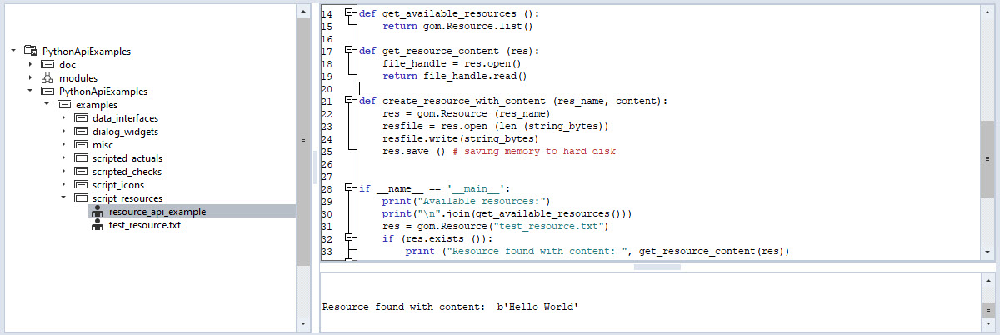

# resource_api_example


## Short description

A simple example showing the usage of script resources.

## Highlights

The example shows how to list available resources:
```python
gom.Resource.list()
```

Then, depending on whether a resource is found (by name), this resource is read or created with the content `Hello World`.

```python
res = gom.Resource("test_resource.txt")
  if (res.exists ()):
    print ("Resource found with content: ", get_resource_content(res))
  else:
    string_bytes = b"Hello World"
    create_resource_with_content ("test_resource.txt", string_bytes)
    print ("Resource created with content:", string_bytes)
```

Output:
```
> Resource found with content:  b'Hello World'
```

For details on how to read and write resource data, see the related documentation below.

## Related

* [How to: Using script resources](https://zeissiqs.github.io/zeiss-inspect-addon-api/2025/howtos/python_api_introduction/using_script_resources.md)
* [`gom.Resource` API Definition](https://zeissiqs.github.io/zeiss-inspect-addon-api/2025/python_api/resource_api.md)