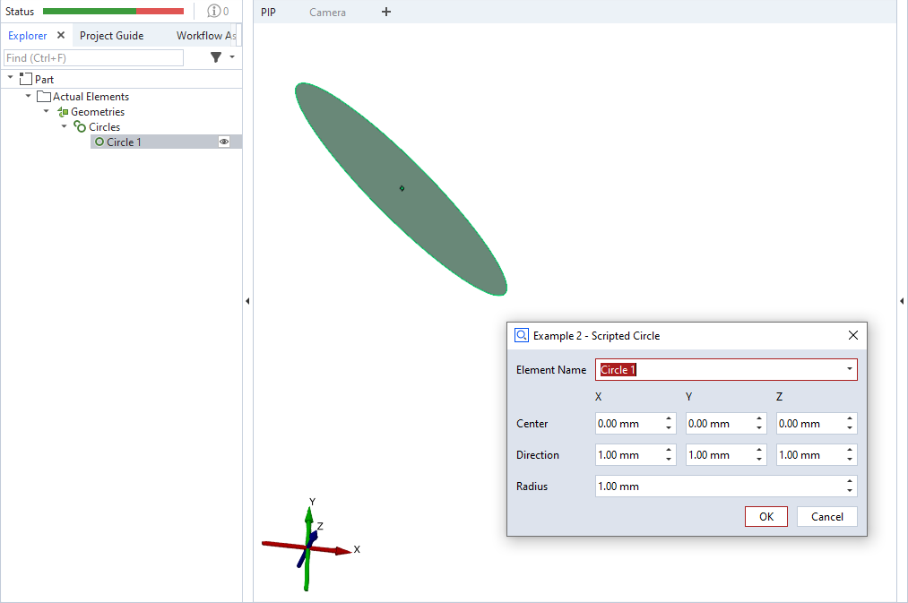

# ScriptedActualCircle



This is an example for a scripted 'circle' element.

> [!NOTE]
> Please see [ScriptedActualPoint](https://github.com/ZEISS/zeiss-inspect-app-examples/blob/main/AppExamples/scripted_actuals/ScriptedActualPoint/doc/Documentation.md) for a complete scripted elements example with detailed description.

## Source code excerpt

```python
def dialog(context, params):
    #[...]

def calculation(context, params):
    valid_results = False

    # Calculating all available stages
    for stage in context.stages:
        # Access element properties with error handling
        try:
            context.result[stage] = {
                'center': (params['center_x'], params['center_y'], params['center_z']),
                'direction': (params['dir_x'], params['dir_y'], params['dir_z']),
                'radius': params['radius']
            }
            context.data[stage] = {"ude_mykey": "Example 2"}
        except Exception as error:
            context.error[stage] = str(error)
        else:
            valid_results = True
    return valid_results
```

## Related

* [Scripted actuals - Circle](https://zeiss.github.io/zeiss-inspect-app-api/2025/python_api/scripted_elements_api.html#circle)
* [How-to: User-defined dialogs](https://zeiss.github.io/zeiss-inspect-app-api/2025/howtos/python_api_introduction/user_defined_dialogs.html)
