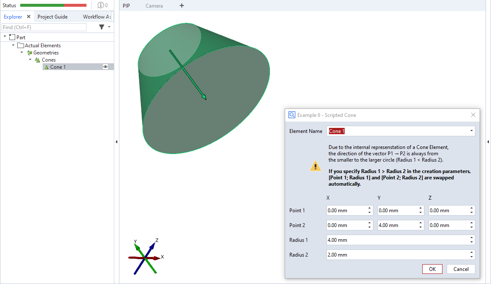

# ScriptedActualCone



This is an example for a scripted 'cone' element. 

```{caution}
Due to the internal represenstation of a Cone Element, the direction of the vector `point1` -> `point2` is always from the smaller to the larger circle (`radius1` < `radius2`).

If you specify `radius1` > `radius2` in the creation parameters, [`point1`; `radius1`] and [`point2`; `radius2`] are swapped automatically.
```

```{note}
Please see [ScriptedActualPoint](https://github.com/ZEISS/zeiss-inspect-app-examples/blob/dev/AppExamples/scripted_actuals/ScriptedActualPoint/doc/Documentation.md) for a complete scripted elements example with detailed description.
```


## Source code excerpt

```{code-block} python
---
linenos:
---
def dialog(context, params):
    #[...]

def calculation(context, params):
    valid_results = False
    # Calculating all available stages
    for stage in context.stages:
        # Access element properties with error handling
        try:
            context.result[stage] = {'default': {
                'point1': gom.Vec3d(params['p1_x'], params['p1_y'], params['p1_z']),
                'radius1': params['radius_1'],
                'point2': gom.Vec3d(params['p2_x'], params['p2_y'], params['p2_z']),
                'radius2': params['radius_2']
            }}
            context.data[stage] = {"ude_mykey": "Example 6"}
        except Exception as error:
            context.error[stage] = str(error)
        else:
            valid_results = True
    return valid_results
```

## Related

* [Scripted actuals - Cone](https://zeissiqs.github.io/zeiss-inspect-addon-api/2025/python_api/scripted_elements_api.md#cone)
* [How-to: User-defined dialogs](https://zeissiqs.github.io/zeiss-inspect-addon-api/2025/howtos/python_api_introduction/user_defined_dialogs.md)