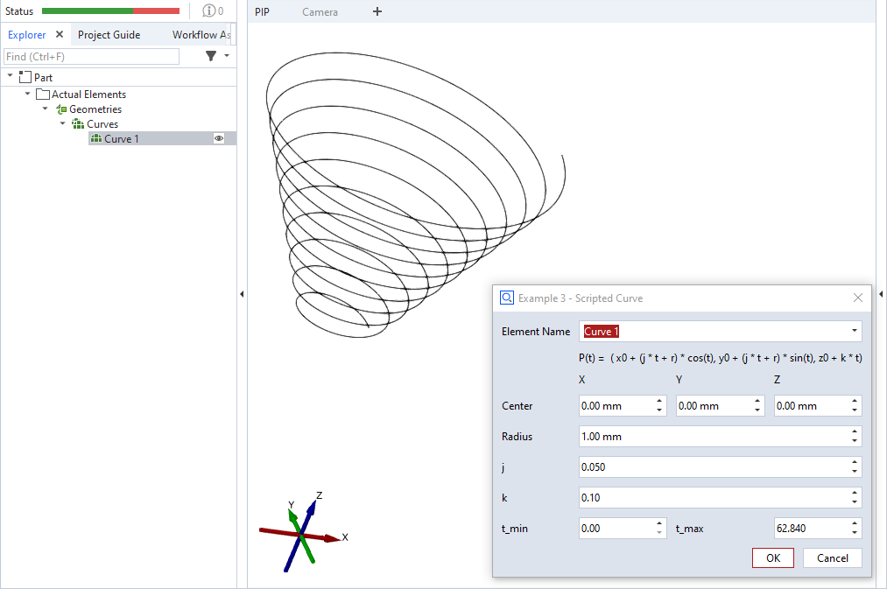

# ScriptedActualCurve



This is an example for a scripted 'curve' element. A parametric function is used to create a 3-dimensional curve - a helix - with a fixed number of points. `np.arange()` is used to iterate from `t_min` to `t_max` with a non-integer step size.

> [!NOTE]
> Please see [ScriptedActualPoint](https://github.com/ZEISS/zeiss-inspect-app-examples/blob/main/AppExamples/scripted_actuals/ScriptedActualPoint/doc/Documentation.md) for a complete scripted elements example with detailed description.

## Source code excerpt

```python
import math
import numpy as np

def dialog(context, params):
    #[...]
    
def calculation(context, params):
    valid_results = False

    # Calculating all available stages
    for stage in context.stages:
        # Access element properties with error handling
        try:
            # Creating a list of points using a parametric curve function:
            # P(t) = ( x0 + (j * t + r) * cos(t), y0 + (j * t + r) * cos(t), z0 + k * t )
            # with t in [t_min...t_max], 1000 steps
            points = []
            for t in np.arange(params['t_min'], params['t_max'], (params['t_max'] - params['t_min']) / 1000):
                points.append((params['x0'] + (params['j'] * t + params['radius']) * math.cos(t),
                            params['y0'] + (params['j'] * t + params['radius']) * math.sin(t),
                            params['z0'] + params['k'] * t)
                            )
            context.result[stage] = [{'points': points}]
            context.data[stage] = {"ude_mykey": "Example 3"}
        except Exception as error:
            context.error[stage] = str(error)
        else:
            valid_results = True
    return valid_results
```

## Related

* [Scripted actuals - Curve](https://zeissiqs.github.io/zeiss-inspect-addon-api/2025/python_api/scripted_elements_api.html#curve)
* [How-to: User-defined dialogs](https://zeissiqs.github.io/zeiss-inspect-addon-api/2025/howtos/python_api_introduction/user_defined_dialogs.html)
