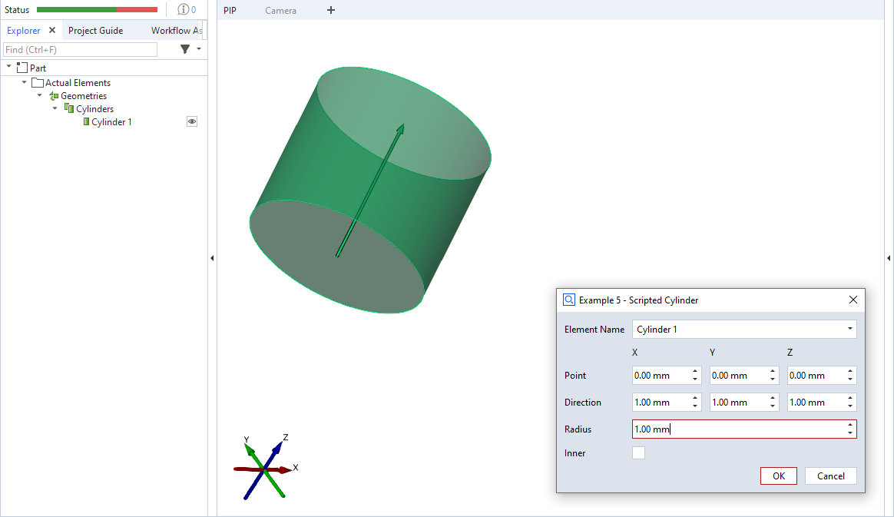

# ScriptedActualCylinder



This is an example for a scripted 'cylinder' element.

> [!NOTE]
> Please see [ScriptedActualPoint](https://github.com/ZEISS/zeiss-inspect-app-examples/blob/main/AppExamples/scripted_actuals/ScriptedActualPoint/doc/Documentation.md) for a complete scripted elements example with detailed description.

## Source code excerpt

```python
def dialog(context, params):
    #[...]

def calculation(context, params):
    valid_results = False
    # Calculating all available stages
    for stage in context.stages:
        # Access element properties with error handling
        try:
            # point = gom.Vec3d(params['point_x'], params['point_y'], params['point_z'])
            # direction = gom.Vec3d(params['dir_x'], params['dir_y'], params['dir_z'])
            context.result[stage] = {'default': {
                'point': gom.Vec3d(params['point_x'], params['point_y'], params['point_z']),
                'radius': params['radius'],
                'direction': gom.Vec3d(params['dir_x'], params['dir_y'], params['dir_z']),
                'inner': params['inner']
            }}
            context.data[stage] = {"ude_mykey": "Example 5"}
        except Exception as error:
            context.error[stage] = str(error)
        else:
            valid_results = True
    return valid_results
```

## Related

* [Scripted actuals - Cylinder](https://zeissiqs.github.io/zeiss-inspect-addon-api/2025/python_api/scripted_elements_api.html#cylinder)
* [How-to: User-defined dialogs](https://zeissiqs.github.io/zeiss-inspect-addon-api/2025/howtos/python_api_introduction/user_defined_dialogs.html)
