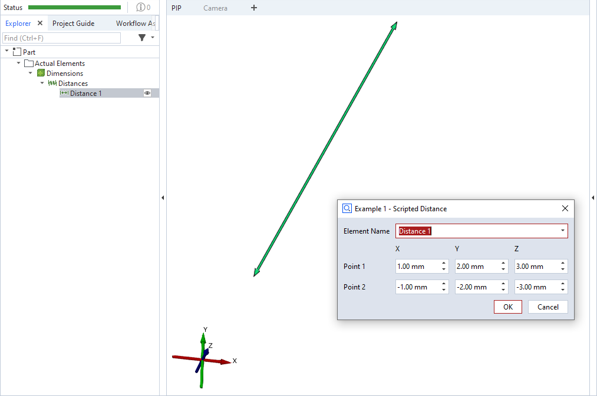

# ScriptedActualPoint



This is an example for a scripted 'distance' element.

> [!NOTE]
> Please see [ScriptedActualPoint](https://github.com/ZEISS/zeiss-inspect-app-examples/blob/main/AppExamples/scripted_actuals/ScriptedActualPoint/doc/Documentation.md) for a complete scripted elements example with detailed description.

## Source code excerpt

```python
def dialog(context, params):
    #[...]


def calculation(context, params):
    valid_results = False

    # Calculating all available stages
    for stage in context.stages:
        # Access element properties with error handling
        try:
            context.result[stage] = {
                'point1': (params['p1_x'], params['p1_y'], params['p1_z']),
                'point2': (params['p2_x'], params['p2_y'], params['p2_z'])
            }
            context.data[stage] = {"ude_mykey": "Example 1"}
        except Exception as error:
            context.error[stage] = str(error)
        else:
            valid_results = True
    return valid_results
```

## Related

* [Scripted actuals - Distance](https://zeiss.github.io/zeiss-inspect-app-api/2025/python_api/scripted_elements_api.html#distance)
* [How-to: User-defined dialogs](https://zeiss.github.io/zeiss-inspect-app-api/2025/howtos/python_api_introduction/user_defined_dialogs.html)
