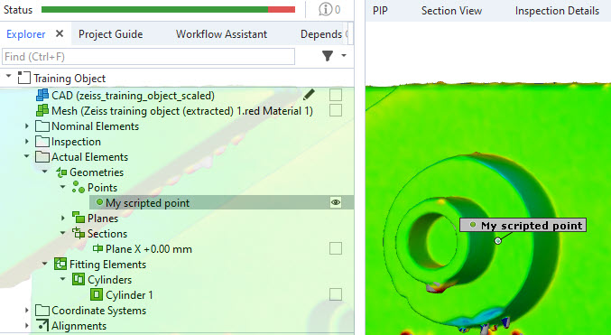
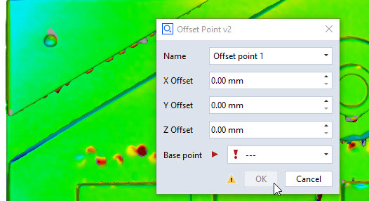

# ScriptedActualPoint

## offset_point_simple



### Short description

```{note}
This is a basic example meant to introduce you to the concept of scripted actual elements. Therefore, head over to the [How-to: Scripted actuals](../../howtos/scripted_elements/scripted_actuals.md) for the documentation of this example.
```

## offset_point_v2 (Includes preview calculation)



### Short description

This example is an extension of the `offset_point_simple` example, which has been discussed in the general [How-to: Scripted actuals](../../howtos/scripted_elements/scripted_actuals.md#example-simple-offset-point).
It shows how to enhance user experience using preview calculation and error handling.

### Highlights

#### Preview calculation

From many of the built-in commands of ZEISS INSPECT, you know the calculation of a preview element during the creation dialog. This means, you can already see the calculation result in the 3D view, while tweaking some parameters in the dialog.

To achieve this behaviour in a scripted element, you need to set up an event handler for the dialog (see also: [How-to: User-defined dialogs](../../howtos/python_api_introduction/user_defined_dialogs.md)). 


```{code-block} python
---
linenos:
---
def dialog_event_handler (widget):
  # No treatment of system events
  if str(widget) == 'system':
    return
  # If preview calculation returned with error
  if str(widget) == 'error':
    DIALOG.control.status = context.error
    return
  # If preview calculation was successful
  if str(widget) == 'calculated':
    DIALOG.control.status = ''
    DIALOG.control.ok.enabled = True
    return
    
  # All other changes in the dialog --> calculate preview
  params['x'] = DIALOG.i_x.value;
  params['y'] = DIALOG.i_y.value;
  params['z'] = DIALOG.i_z.value;
  params['base'] = DIALOG.point.value
  context.name = DIALOG.name.value
  DIALOG.control.ok.enabled = False
  context.calc(params=params, dialog=DIALOG)

DIALOG.handler = dialog_event_handler
```

The event handler function is to be defined taking one argument. This argument will be a handle to the cause (the event) triggering the handler. This can be a string message or a handle to a specific widget of the dialog. We'll come back to this in a second

The handler function shown above basically reads the current set of parameters from the `DIALOG` to the `params` array (lines 16-19). In this case, the offset values and base point. Then, the preview calculation is started using the special functional `context.calc`, which is a function handle taking the set of `params` and a reference to the dialog triggering the preview (line 22).


```{attention}
Only call `context.calc(...)` from a script dialog's *event handler* function, **NOT** from the scripted element's `dialog` function itself.
```

The handler is applied to the dialog in the `dialog` function of the scripted element, just before the dialog is shown to the user (line 23).

#### Status and error handling

Using the dialog's event handler, we can also make the dialog responsive to successful or failed preview calculations. Therefore, the `DIALOG.control.ok.enabled` can be used to control the enabledness of the dialog's OK button.

In line 21, the OK button is disabled before preview calculation is started.

Furthermore, the scripted element framework provides two special event triggers: `error` and `calculated`, which are sent on failing/success of the `calculation` function to the dialog referenced in the `context.calc` call.

In this case, we set a potential error message of a failed calcualtion to the dialogs error indicator (line 7), or enable the OK button and reset the error indicator in case of a successful calculation (lines 11-12).


#### Stageful `calculation` and error handling
 
Above, we discussed changes applied to the scripted element's `dialog` function. Now, let's take a look at the `calculation` function.

```{code-block} python
---
linenos:
---
def calculation(context, params):
  valid_results=False
  # Calculating all available stages
  for stage in context.stages:
    # Access element properties with error handling
    try:
      base = params['base'].in_stage[stage].center_coordinate
      context.result[stage] = (base.x + params['x'], base.y + params['y'], base.z + params['z'])
      context.data[stage] = { "ude_mykey" : 123456 }
    except Exception as error:
      context.error[stage] = str(error)
    else:
      valid_results=True
  return valid_results
```

The first noticeable difference to the *offset_point_simple* example is the calculation over all *stages* of the project, whose indices can be obtained using `context.stages` (line 4).

```{seealso}
If you are not familiar with the concept of *stages*, get an impression in our [Starter Training](https://training.gom.com/course/277348/module/788965). 
```

Second, the [access of element properties](../../howtos/python_api_introduction/python_api_introduction.md#access-element-properties) is also respecting the current stage using the `.in_stage` mechanism (line 7).

Third, you can see that the calculation is surrounded by a `try/except` block that catches potential errors and sets arising error messages to `context.error`. This examples catches all exceptions in a very basic way. In a real-world application, you should distinguish several types of exceptions you'd expect and set meaningful error messages. The `context.error` message is then handled in the dialog as discussed above (see [Status and error handling](#status-and-error-handling)).

#### Storing generic element data

You can observe an assignment to the `context.data` member (line 9). If you assign a dictionary (map) to this data structure, you can save *user-defined tokens* to the scripted element. These are key/value pairs that can hold generic information you might to retrieve in consecutive scripts or checks that reference the created scripted element. 

```{note} 
Keys of *user-defined tokens* need to start with `ude_`. For more information, see the [Scripted elements API documentation](../../python_api/scripted_elements_api.md).
```

After element creation of such an offset point with name "Offset point 1", you could access this data again like:
```python
import gom

print (gom.app.project.actual_elements['Offset point 1'].ude_mykey)
```
Output:
```
> 123456
```


## Related

* [Scripted actuals - Point](https://zeissiqs.github.io/zeiss-inspect-addon-api/2025/python_api/scripted_elements_api.html#point)
* [How-to: User-defined dialogs](https://zeissiqs.github.io/zeiss-inspect-addon-api/2025/howtos/python_api_introduction/user_defined_dialogs.md)
