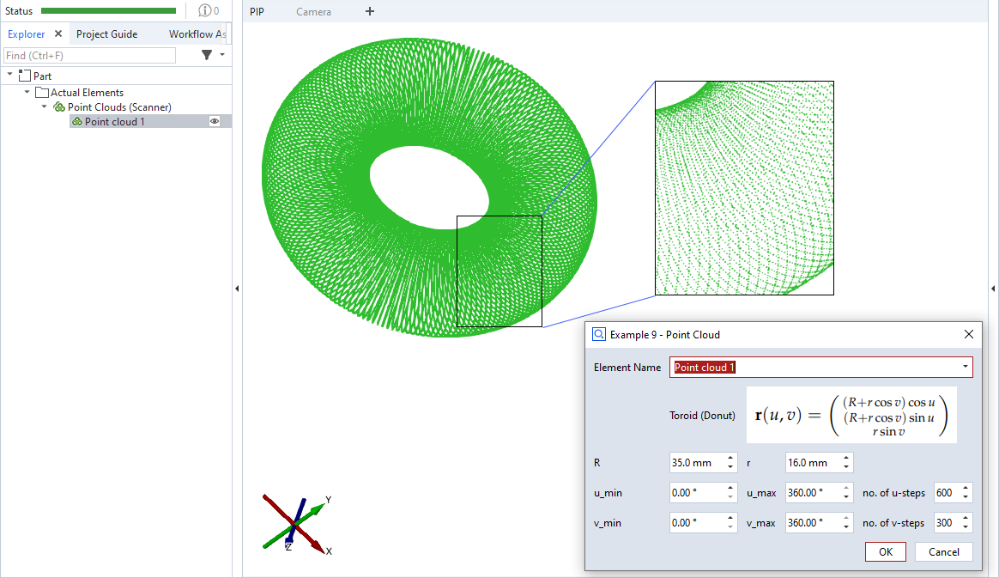

# ScriptedActualPointCloud



This is an example for a scripted 'point cloud' element. A parametric function is used to define the points, in this case the surface points of a torus. `np.arange()` is used to iterate from `u_min` to `u_max` and from `v_min` to `v_max` with non-integer step sizes. The step sizes `u_steps` and `v_steps` define the point density.

> [!NOTE]
> Please see [ScriptedActualPoint](https://github.com/ZEISS/zeiss-inspect-app-examples/blob/main/AppExamples/scripted_actuals/ScriptedActualPoint/doc/Documentation.md) for a complete scripted elements example with detailed description.

## Source code excerpt

```python
def dialog(context, params):
    #[...]

def calculation(context, params):
    valid_results = False

    # Calculating all available stages
    for stage in context.stages:
        # Access element properties with error handling
        try:
            # Creating a list of points using a parametric curve function:
            #            / (R+r*cos(v))*cos(u) \
            # P(u, v) = |  (R+r*cos(v))*sin(u)  |
            #            \ r*sin(v)            /
            # with u in [u_min...u_max], v in [v_min...v_max]
            points = []
            for u in np.arange(params['u_min'], params['u_max'], (params['u_max'] - params['u_min']) / params['u_steps']):
                for v in np.arange(params['v_min'], params['v_max'], (params['v_max'] - params['v_min']) / params['v_steps']):
                    p = gom.Vec3d(
                        (params['R'] + params['r'] * math.cos(v * math.pi)) * math.cos(u * math.pi),
                        (params['R'] + params['r'] * math.cos(v * math.pi)) * math.sin(u * math.pi),
                        params['r'] * math.sin(v * math.pi)
                    )
                    points.append(p)

            context.result[stage] = {'points': points}
            context.data[stage] = {"ude_mykey": "Example 9"}
        except Exception as error:
            context.error[stage] = str(error)
        else:
            valid_results = True
    return valid_results
```

## Related

* [Scripted actuals - Point cloud](https://zeiss.github.io/zeiss-inspect-app-api/2026/python_api/scripted_elements_api.html#point-cloud)
* [How-to: User-defined dialogs](https://zeiss.github.io/zeiss-inspect-app-api/2026/howtos/user_defined_dialogs/user_defined_dialogs.html)
