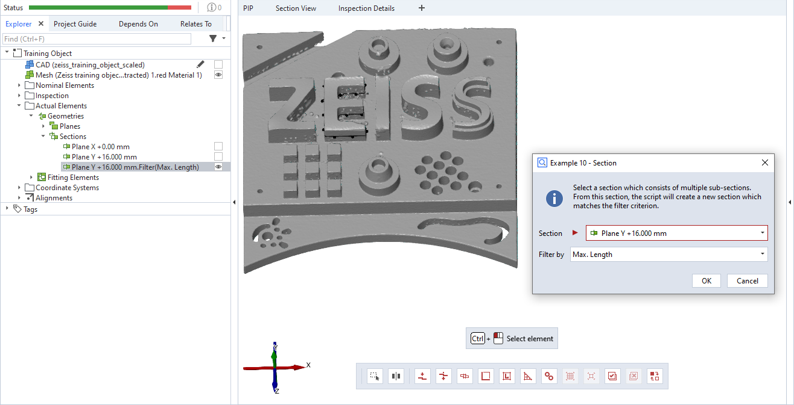

# ScriptedActualSection



This is an example for a scripted 'section' element. The dialog allows to select an existing section, which may consist of multiple sub sections. The script creates a new section from the existing one, with the selected filter criterion.

> [!NOTE]
> Please see [ScriptedActualPoint](https://github.com/ZEISS/zeiss-inspect-app-examples/blob/main/AppExamples/scripted_actuals/ScriptedActualPoint/doc/Documentation.md) for a complete scripted elements example with detailed description.

## Functions for calculating the section

```python
def calc_section_length(verts, indices=None):
    '''Calculate length of (sub-)section'''
    if indices is None:
        indices = range(len(verts))
    l = 0

    # Length: Sum of Euclidean distance between each two adjacent vertices of the curve
    for i, j in zip(indices, indices[1:]):
        l += la.norm(verts[j] - verts[i])
    return l


def get_sub_sections(base_curve, stage=0):
    """Separate section curve into sub-sections by checking if a point is connected to another point

    Returns:
    array of curves
    """
    curve_coords = np.array(base_curve.data.coordinate)[stage]
    curve_normals = np.array(base_curve.data.normal)[stage]
    sub_sections = []
    start_index = 0
    for end_index, conn in enumerate(base_curve.scanline_point_connection):
        if conn != "connected":
            sub_sections.append((curve_coords[start_index:end_index + 1], curve_normals[start_index:end_index + 1]))
            start_index = end_index + 1
    return sub_sections


def filter_by_length(sub_sections, mode):
    '''Filter an array of curves by length and return the curve matching the filter criterion'''
    max_len = 0
    min_len = 0
    r_min = None
    r_max = None

    # For all sub-sections, calculate min. and max. length
    # and save the vertices and normals of both the shortest/longest curve
    for verts, normals in sub_sections:
        ssl = calc_section_length(verts)
        if max_len < ssl:
            max_len = ssl
            r_max = verts, normals
        if min_len == 0 or min_len > ssl:
            min_len = ssl
            r_min = verts, normals
    if mode.lower() == "max. length":
        return r_max
    else:
        return r_min
```    

## Dialog and calculation functions

```{code-block} python
---
linenos:
---
def dialog(context, params):
    #[...]

def calculation(context, params):
    '''Scripted section calculation function'''
    valid_results = False

    # Check if filter mode is defined
    if params["i_mode"].lower() in ["min. length", "max. length"]:
        f = filter_by_length
    else:
        raise ValueError(f"Unknown mode: {params['i_mode']}")

    for stage in context.stages:
        # Get selected section from stage
        section = params["i_elem"].in_stage[stage]

        # Get sub-sections
        sub_sections = get_sub_sections(section, stage)

        # Apply filter
        sub_section = f(sub_sections, params["i_mode"])

        # Get vertices and normals of resulting sub-section
        verts, normals = sub_section

        data = [{"points": [gom.Vec3d(*v) for v in verts], "normals": [gom.Vec3d(*n) for n in normals]}]

        try:
            context.result[stage] = {"curves": data}
            context.data[stage] = {"ude_mykey": "Example 10"}
        except Exception as error:
            context.error[stage] = str(error)
        else:
            valid_results = True

    return valid_results
```

## Related

* [Scripted actuals - Section](https://zeiss.github.io/zeiss-inspect-app-api/2025/python_api/scripted_elements_api.html#section)
* [How-to: User-defined dialogs](https://zeiss.github.io/zeiss-inspect-app-api/2025/howtos/python_api_introduction/user_defined_dialogs.html)
