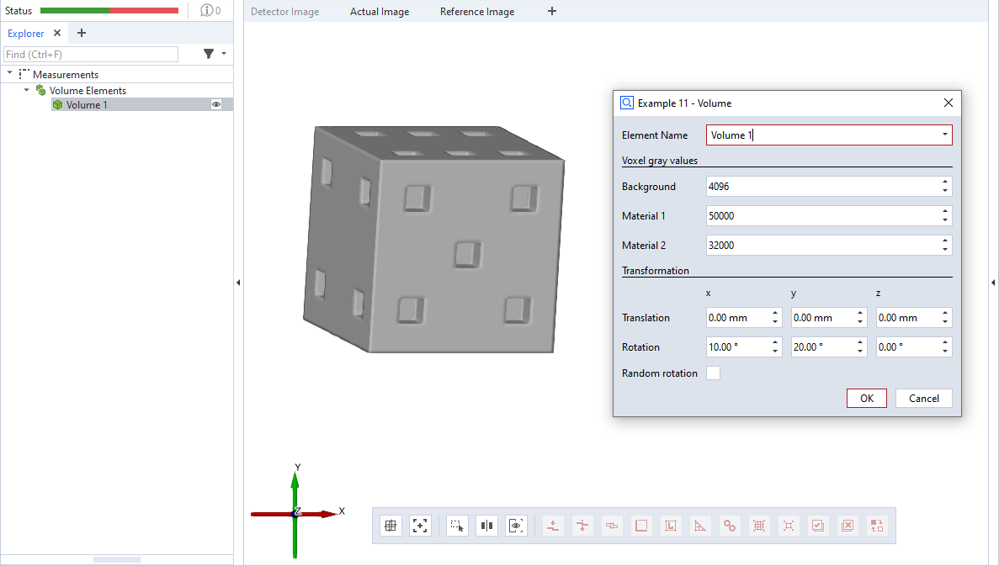

# ScriptedActualVolume



This is an example for a scripted 'volume' element. The volume data is created as an np.array of shape 70&times;70&times;70. Each element defines a voxel with a default gray value `gv1` (`calculation()`, lines 11&amp;12). The function `set_voxeldata()` changes some of the gray values to `gv2` (line 13). The resulting volume object resembles a die. Finally the volume data is padded in each direction with voxels of the background gray value `gv0`.

The dialog allows to set the gray values and to apply a transformation to the volume element.

> [!CAUTION]
> The voxel (measurement) coordinate system may differ from the CAD coordinate system. 

> [!NOTE]
> Please see [ScriptedActualPoint](https://github.com/ZEISS/zeiss-inspect-app-examples/blob/main/AppExamples/scripted_actuals/ScriptedActualPoint/doc/Documentation.md) for a complete scripted elements example with detailed description.

## Function for setting voxel data

```python
def set_voxeldata(voxels, gv, e):
    """Set the gray value of some voxels

    :param voxels: np.array() of shape (70, 70, 70)
    :param gv: gray value to set
    :param e: extend around (fixed) nominal voxel coordinate
    """

    # (1) - front
    for x in range(-e, e + 1):
        for y in range(-e, e + 1):
            for z in range(-e, e + 1):
                voxels[35 + x, e + y, 35 + z] = gv

    # (6) - back
    for x in range(-e, e + 1):
        for y in range(-e, e + 1):
            for z in range(-e, e + 1):
                voxels[15 + x, 69 - e + y, 15 + z] = gv
                voxels[15 + x, 69 - e + y, 35 + z] = gv
                voxels[15 + x, 69 - e + y, 55 + z] = gv
                voxels[55 + x, 69 - e + y, 15 + z] = gv
                voxels[55 + x, 69 - e + y, 35 + z] = gv
                voxels[55 + x, 69 - e + y, 55 + z] = gv

    # (3) - top
    for x in range(-e, e + 1):
        for y in range(-e, e + 1):
            for z in range(-e, e + 1):
                voxels[15 + x, 15 + y, 69 - e + z] = gv
                voxels[35 + x, 35 + y, 69 - e + z] = gv
                voxels[55 + x, 55 + y, 69 - e + z] = gv
    #[...]
```    

## Dialog and calculation functions

```{code-block} python
---
linenos:
---
def dialog(context, params):
    #[...]

def calculation(context, params):
    valid_results = False

    e = 4
    gv0 = params['gv_background']
    gv1 = params['gv_mat1']
    gv2 = params['gv_mat2']
    voxels = np.ones((70, 70, 70), dtype=np.uint16)
    voxels = voxels * gv1
    set_voxeldata(voxels, gv2, e)
    voxels = np.pad(voxels, 30, 'constant', constant_values=gv0)

    rx = params['rx']
    ry = params['ry']
    rz = params['rz']
    dx = params['dx']
    dy = params['dy']
    dz = params['dz']

    transformation = gom.Mat4x4([
        cos(rz) * cos(ry), cos(rz) * sin(ry) * sin(rx) - sin(rz) *
        cos(rx), cos(rz) * sin(ry) * cos(rx) + sin(rz) * sin(rx), dx - 35,
        sin(rz) * cos(ry), sin(rz) * sin(ry) * sin(rx) + cos(rz) *
        cos(rx), sin(rz) * sin(ry) * sin(rx) - cos(rz) * sin(rx), dy - 35,
        -sin(ry), cos(ry) * sin(rx), cos(ry) * cos(rx), dz - 35,
        0, 0, 0, 1
    ])

    # Calculating all available stages
    for stage in context.stages:
        # Access element properties with error handling
        try:
            context.result[stage] = {'voxel_data': voxels, 'transformation': transformation}
            context.data[stage] = {"ude_mykey": "Example 11"}
        except Exception as error:
            context.error[stage] = str(error)
        else:
            valid_results = True
    return valid_results
```

## Related

* [Scripted actuals - Section](https://zeiss.github.io/zeiss-inspect-app-api/2025/python_api/scripted_elements_api.html#volume)
* [How-to: User-defined dialogs](https://zeiss.github.io/zeiss-inspect-app-api/2025/howtos/python_api_introduction/user_defined_dialogs.html)
