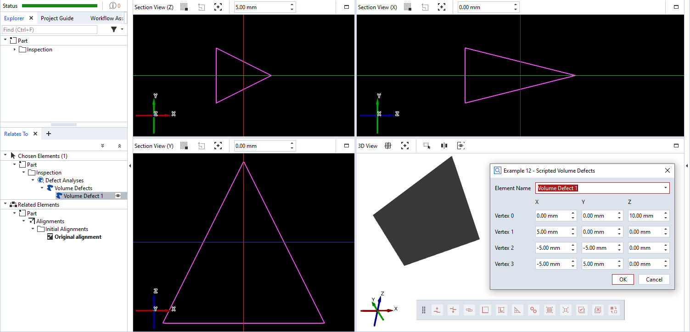

# ScriptedActualVolumeDefects



This is an example for a scripted 'volume defects' element. Each defect is defined by a mesh. In this example, a single defect is created by setting the coordinates of four vertices from a dialog. The mesh triangles are hard-coded in the `calculation()` function. The resulting element has the shape of a tetrahedron.

```{note}
The mesh triangles are defined by indices into the array of vertices. The vertices defining a triangle must be specified in counter-clockwise
order (as viewed from outside).
```

```{note}
Please see [ScriptedActualPoint](https://github.com/ZEISS/zeiss-inspect-app-examples/blob/dev/AppExamples/scripted_actuals/ScriptedActualPoint/doc/Documentation.md) for a complete scripted elements example with detailed description.
```


## Source code excerpt

```{code-block} python
---
linenos:
---
def dialog(context, params):
    #[...]
    
def calculation(context, params):
    valid_results = False
    v0 = (params['v0_x'], params['v0_y'], params['v0_z'])
    v1 = (params['v1_x'], params['v1_y'], params['v1_z'])
    v2 = (params['v2_x'], params['v2_y'], params['v2_z'])
    v3 = (params['v3_x'], params['v3_y'], params['v3_z'])

    # Calculating all available stages
    for stage in context.stages:
        # Access element properties with error handling
        try:
            context.result[stage] = {
                'vertices': [np.array([v0, v1, v2, v3])],
                # Note:
                # Triangles are defined by indices into the array of vertices.
                # The vertices defining a triangle must be specified in counter-clockwise
                # order, otherwise the resulting surface would be inverted, i.e. invisible!
                'triangles': [np.array([(0, 1, 2), (1, 0, 3), (0, 2, 3), (2, 1, 3)])]
            }
            context.data[stage] = {"ude_mykey": "Example 12"}
        except Exception as error:
            context.error[stage] = str(error)
        else:
            valid_results = True
    return valid_results
```

## Related

* [Scripted actuals - Volume defects](https://zeissiqs.github.io/zeiss-inspect-addon-api/2025/python_api/scripted_elements_api.md#volume-defects)
* [How-to: User-defined dialogs](https://zeissiqs.github.io/zeiss-inspect-addon-api/2025/howtos/python_api_introduction/user_defined_dialogs.md)