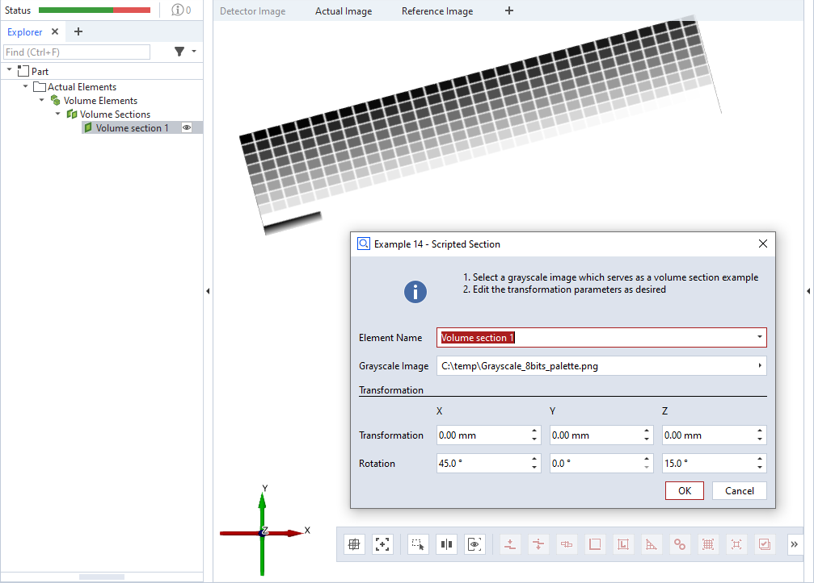

# ScriptedActualVolumeSection



This is an example for a scripted 'volume section' element. The dialog allows to select an image file, which is converted to a grayscale image (`calculation()`, line 30) and then to an `np.array()` (line 32). Further, a transformation is applied to the image.

```{note}
Please see [ScriptedActualPoint](https://github.com/ZEISS/zeiss-inspect-app-examples/blob/dev/AppExamples/scripted_actuals/ScriptedActualPoint/doc/Documentation.md) for a complete scripted elements example with detailed description.
```

## Source code excerpt

```{code-block} python
---
linenos:
---
import numpy as np
from math import sin, cos
from PIL import Image
from io import BytesIO

def dialog(context, params):
    #[...]

def calculation(context, params):
    valid_results = False

    file = params['file']

    # if filename starts with ':', it is an app resource used for testing,
    # e.g. ':ScriptedElementsExamples/Grayscale_8bits_palette.png'
    if file and file[0] == ':':
        # read resource
        test_image_resource = gom.Resource(file)
        test_image = test_image_resource.open().read()

        # convert resource to file object
        file = BytesIO(test_image)

    try:
        image = Image.open(file)
    except AttributeError:
        return False

    # convert image to grayscale
    image = image.convert('L')
    # print (image)
    img_array = np.array(image, dtype=np.float32)
    # print(f"img_array: {img_array}")
    # print(f"img_array.shape: {img_array.shape}")

    rx = params['rx']
    ry = params['ry']
    rz = params['rz']
    dx = params['dx']
    dy = params['dy']
    dz = params['dz']

    transformation = gom.Mat4x4([
        cos(rz) * cos(ry), cos(rz) * sin(ry) * sin(rx) - sin(rz) *
        cos(rx), cos(rz) * sin(ry) * cos(rx) + sin(rz) * sin(rx), dx,
        sin(rz) * cos(ry), sin(rz) * sin(ry) * sin(rx) + cos(rz) *
        cos(rx), sin(rz) * sin(ry) * sin(rx) - cos(rz) * sin(rx), dy,
        -sin(ry), cos(ry) * sin(rx), cos(ry) * cos(rx), dz,
        0, 0, 0, 1
    ])
    # print(transformation)

    # Calculating all available stages
    for stage in context.stages:
        # Access element properties with error handling
        try:
            context.result[stage] = {
                'pixel_data': img_array,
                'transformation': transformation
            }
            context.data[stage] = {"ude_mykey": "Example 14"}
        except Exception as error:
            context.error[stage] = str(error)
        else:
            valid_results = True
    return valid_results
```

## Related

* [Scripted actuals - Volume section](https://zeissiqs.github.io/zeiss-inspect-addon-api/2025/python_api/scripted_elements_api.md#volume-section)
* [How-to: User-defined dialogs](https://zeissiqs.github.io/zeiss-inspect-addon-api/2025/howtos/python_api_introduction/user_defined_dialogs.md)