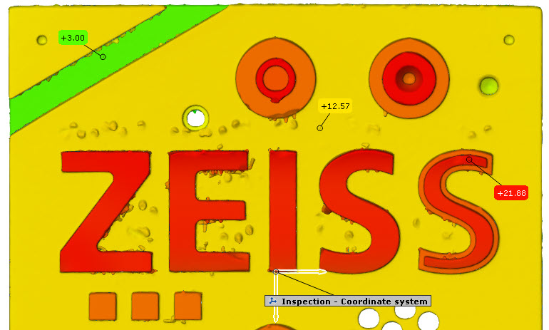

# ScriptedSurfaceCheck



## Short description

This example demonstrates how to create a scalar surface check by a script. Also, the usage of custom coordinate systems and element preview in scripted checks is shown.

## Highlights

First of all, we need to check if the element selected by the user by the `DIALOG.slct_element` widget is suitable for being checked with a surface check. You can implement your own filter for that, but you can also use the API convenience function for that purpose, which only allow "mesh-like" elements:

```python
DIALOG.slct_element.filter = gom.api.scripted_checks_util.is_surface_checkable
```

The usage of custom coordinate systems is the same as described in the [scripted_curve_check](scripted_curve_check.md) example.

Finally, the result is to be set. For each point of the referenced mesh, a deviation value is needed. Therefore, the result takes the following form, where `deviation_result` is a vector with length equal to number of mesh points.

```python
result = { "deviation_values" : deviation_result , "reference" : element }
```

As in the [scripted_curve_check](scripted_curve_check.md) example, the result for each point is just the respective `y` coordinate to easily see the correctness of the results including a given transformation.

Using the example project `zeiss_part_test_project` and the viewing coordinate system, you get the screenshot shown on top. However, if you select the coordinate system `Cylinder 1|Plane 1|Origin`, you can see the transformation in effect:


## Related

* [How-to: Scripted checks](https://zeissiqs.github.io/zeiss-inspect-addon-api/2025/howtos/scripted_elements/scripted_checks.md)
* [Scripted Element API](https://zeissiqs.github.io/zeiss-inspect-addon-api/2025/python_api/scripted_elements_api.md)