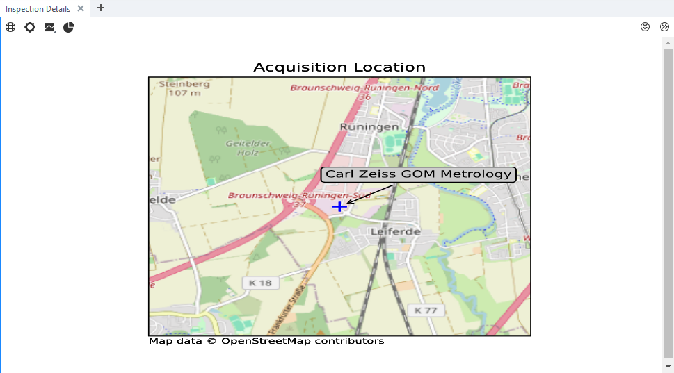
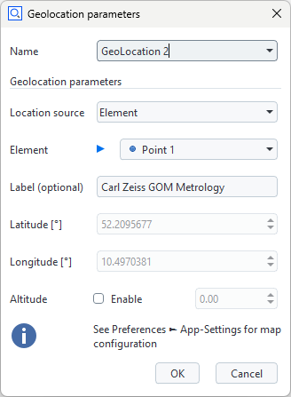
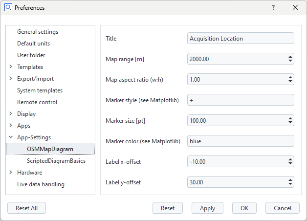

# OSMMapDiagram



## Short description

The script `LocationScalarElement.py` generates a scripted value element, which passes location information to the diagram service `OSMMapDiagram`. The service implemented in `service.py` creates a map from [OpenStreetMap](https://www.openstreetmap.org/) (OSM) data using the Python packages [Cartopy](https://scitools.org.uk/cartopy/docs/latest/index.html) and [Matplotlib](https://matplotlib.org/). The map's center is defined by the location data. The location markers and labels (optional) are added to the map. Some map configurations can be set via Preferences ► App-Settings.

This example demonstrates the flexibility of scripted diagrams. It can be used for reporting of measurements acquired 'in the field', e.g. with ZEISS [T-SCAN hawk 2](https://www.handsonmetrology.com/products/t-scan-hawk-2/) or ZEISS [TRITOP](https://www.zeiss.com/metrology/en/systems/optical-3d/3d-photogrammetry/tritop.html).

> [!WARNING]
> Only one service function may be used at a time.
> All diagram services currently not in use must be stopped, otherwise no diagram is created.

Location information can be provided by
* Manual input in the GeoLocation element creation dialog
* Element keywords of any element
* Project keywords

The supported element keywords / project keywords are `GPSLatitude`, `GPSLongitude` and `GPSAltitude`.

> [!CAUTION]
> If an element keyword is not defined, a project keyword with the same name is automatically used instead.

## Prerequisite

Review [Using scripted diagrams](https://zeissiqs.github.io/zeiss-inspect-addon-api/2025/howtos/using_scripted_diagrams/using_scripted_diagrams.html) for a general introduction.

## Creating a GeoLocation scripted value element



In addition to the general concept of using scripted elements directly as the data source for scripted diagrams, the GeoLocation elements can also serve as a proxy for location information stored as element keywords (of any element) or project keywords.

The location information is passed as parameters to the scripted diagram service using:
```
context.data[stage] = {
    "ude_diagram_custom": 1,                       # mandatory, fixed
    "ude_diagram_type": "SVGDiagram",              # mandatory, fixed
    "ude_diagram_alt": <altitude>,                 # altitude
    "ude_diagram_alt_en": <enable_altitude_label>, # True or False
    "ude_diagram_label": '<label>',                # optional, can be empty
    'ude_diagram_lat': <latitude>,                 # latitude in decimal degrees
    'ude_diagram_lon': <longitude>                 # longitude in decimal degrees
}
 ```
 
## Managing the scripted diagram services

Use Apps->Manage Services... to start `OSMMapDiagram` and stop any diagram service currently not in use. Only one diagram service may be active!

## Diagram settings
 


This feature is implemented using the [Settings API](https://zeissiqs.github.io/zeiss-inspect-addon-api/2025/python_api/python_api.html#gom-api-settings).

The settings are stored in `metainfo.json`:
 ```
...
"settings": [
    {
        "description": "Title",
        "name": "title",
        "value": "Acquisition Location",
        "visible": true
    },
    {
        "description": "Map range [m]",
        "name": "range",
        "value": 5000,
        "visible": true
    },
    {
        "description": "Map aspect ratio (w:h)",
        "name": "aspect",
        "value": 1,
        "visible": true
    },
    {
        "description": "Marker style (see Matplotlib)",
        "name": "marker_style",
        "value": "x",
        "visible": true
    },
    ...
],
...
 ```
 
 ## View the map diagram
 
 The diagram is shown in the tab **Inspection Details** in the 3D view. Adding/removing scripted elements contributing to the diagram or modifying the scripted elements' creation parameters updates the diagram accordingly.
 
 ## See also
 
 * [Scripted elements](https://zeissiqs.github.io/zeiss-inspect-addon-api/2025/howtos/scripted_elements/scripted_elements_toc.html)
 * [Tokens on scripted elements](https://zeissiqs.github.io/zeiss-inspect-addon-api/2025/howtos/scripted_elements/tokens_on_scripted_elements.html)
 * [Using services](https://zeissiqs.github.io/zeiss-inspect-addon-api/2025/howtos/using_services/using_services.html)
 * [Settings API](https://zeissiqs.github.io/zeiss-inspect-addon-api/2025/python_api/python_api.html#gom-api-settings)
 * [Cartopy](https://scitools.org.uk/cartopy/docs/latest/index.html)
 * [Matplotlib: Visualization with Python](https://matplotlib.org/)
 
 