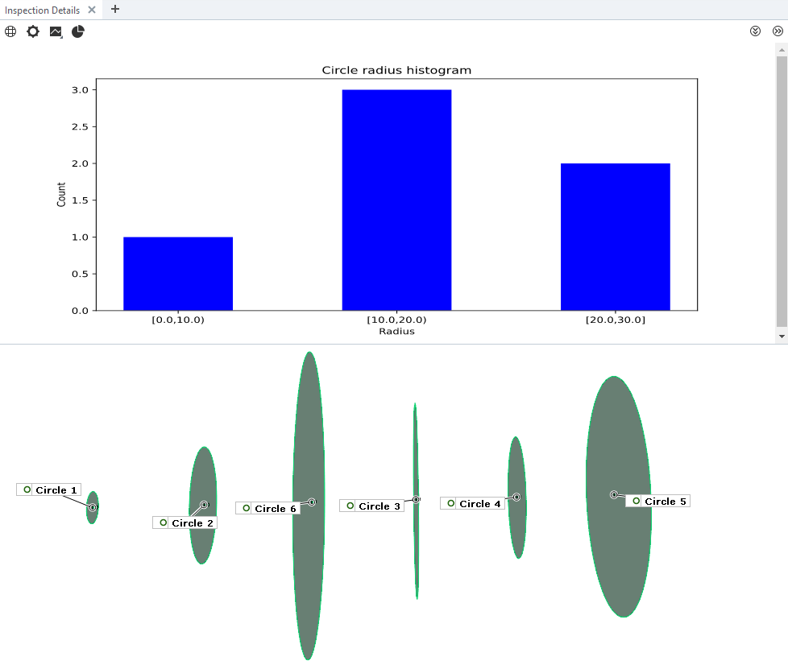
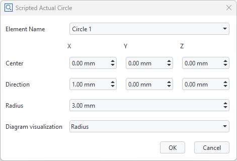
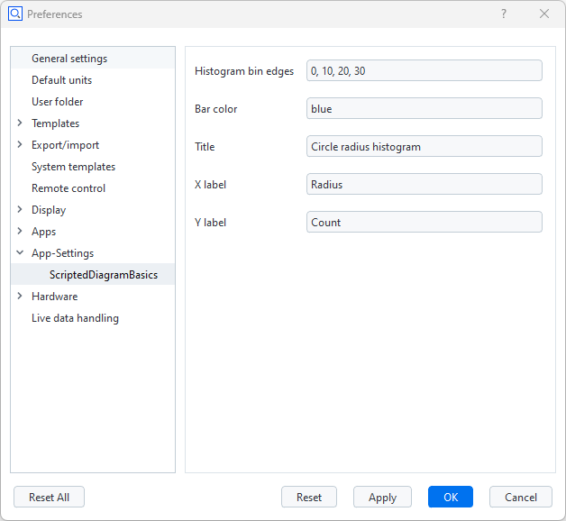

# ScriptedDiagramBasics



## Short description

This example includes a script for generation of scripted actual circles, which can provide data &mdash; their radius &mdash; to any of two scripted diagram services. The diagram service `RadiusPlot` plots the radius of each circle element, the diagram service `RadiusHistogram` creates a radius histogram.

> [!NOTE]
> Only one service function may be used at a time.
> All diagram services currently not in use must be stopped, otherwise no diagram is created.

## Prerequisite

Review [Using scripted diagrams](https://zeissiqs.github.io/zeiss-inspect-addon-api/2025/howtos/using_scripted_diagrams/using_scripted_diagrams.html) for a general introduction.

## Creating scripted actual circle elements



The script `scr_act_circle.py` creates a scripted circle and passes the radius to any of the two scripted diagram services, which is selected from the circle's creation parameters dialog.

The radius of any scripted circle is passed as a parameter to the scripted diagram service using:
```
context.data[stage] = {
    "ude_diagram_custom": 1,
    "ude_diagram_type": "SVGDiagram",
    # Selected by circle creation dialog: "gom.api.diagram.radius_plot" or "gom.api.statistics.radius_histogram"
    "ude_diagram_service" : params['service'],
    "ude_diagram_radius": params['radius']
}
```

## Managing the scripted diagram services

Use Apps->Manage Services... to start either `RadiusPlot` or `RadiusHistogram` and stop any diagram service currently not in use. Only one diagram service may be active!

## Diagram settings



The `RadiusHistogram` service uses some user settings from Preferences->App-Settings.

This feature is implemented using the [Settings API](https://zeissiqs.github.io/zeiss-inspect-addon-api/2025/python_api/python_api.html#gom-api-settings).

The settings are stored in `metainfo.json`:
```
...
"settings": [
        {
            "description": "Histogram bin edges",
            "name": "bins",
            "value": "0, 10, 20, 30",
            "visible": true
        },
        {
            "description": "Bar color",
            "name": "barcolor",
            "value": "blue",
            "visible": true
        },
        {
            "description": "Title",
            "name": "title",
            "value": "Circle radius histogram",
            "visible": true
        },
        {
            "description": "X label",
            "name": "xlabel",
            "value": "Radius",
            "visible": true
        },
        {
            "description": "Y label",
            "name": "ylabel",
            "value": "Count",
            "visible": true
        }
],
...
```

## View the diagram

The diagram is shown in the tab **Inspection Details** in the 3D view. Adding/removing scripted elements contributing to the diagram or modifying the scripted elements' creation parameters updates the diagram accordingly.

## See also

* [Scripted elements](https://zeissiqs.github.io/zeiss-inspect-addon-api/2025/howtos/scripted_elements/scripted_elements_toc.html)
* [Tokens on scripted elements](https://zeissiqs.github.io/zeiss-inspect-addon-api/2025/howtos/scripted_elements/tokens_on_scripted_elements.html)
* [Using services](https://zeissiqs.github.io/zeiss-inspect-addon-api/2025/howtos/using_services/using_services.html)
* [Settings API](https://zeissiqs.github.io/zeiss-inspect-addon-api/2025/python_api/python_api.html#gom-api-settings)

